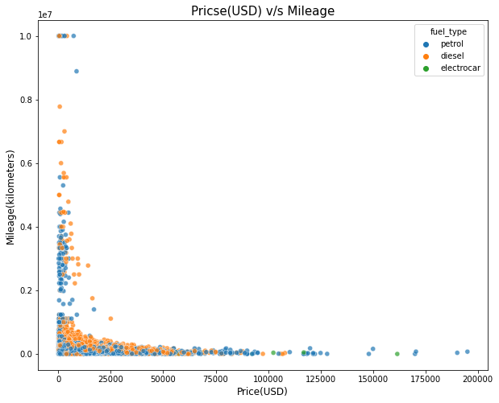
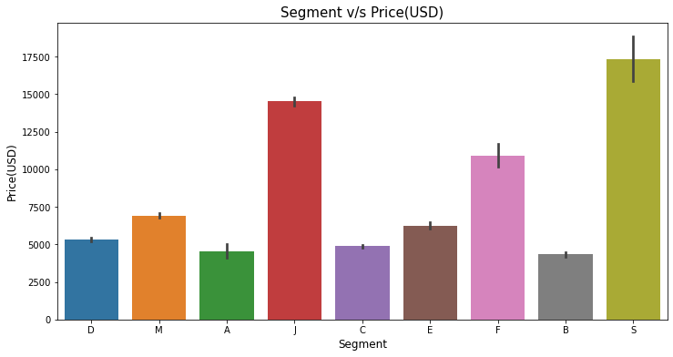
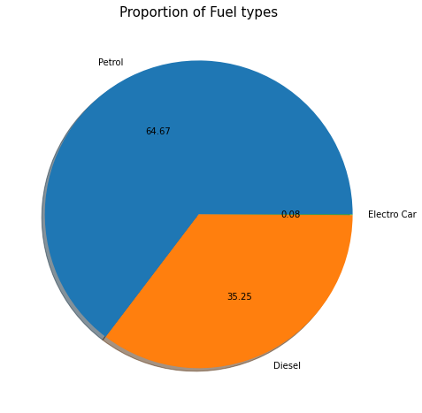
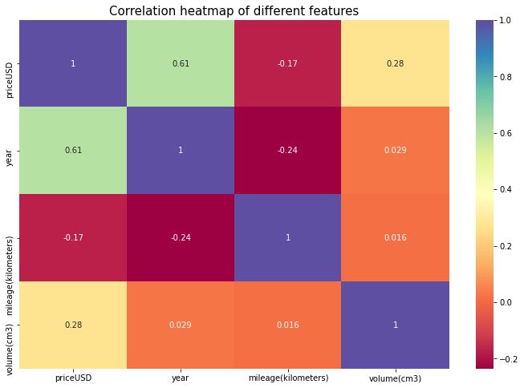
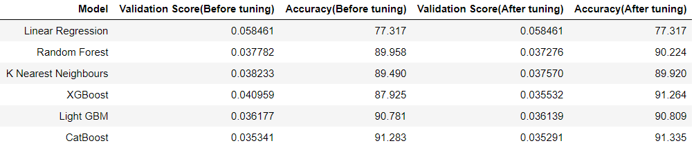

# Used Cars Price Prediction and Evaluation

## Intro:

A used car, a pre-owned vehicle, or a secondhand car, is a vehicle that has previously had one or more retail owners. Used cars are sold through a variety of outlets, including franchise and independent car dealers, rental car companies, buy here pay here dealerships, leasing offices, auctions, and private party sales. Some car retailers offer "no-haggle prices," "certified" used cars, and extended service plans or warranties.

## Project Overview:

This project is based on predicting and evaluating the price of used cars given some specifications.

## Project Goal / Objective:

To analyse the data of used cars and build a model that can predict the price of used cars based on some car specifications.

## Outcome:

Achieved an RMSLE(root mean squared log error) score = 0.03488305748337859 and Accuracy = 91.596 in predicting the price of used cars in the test set.

## **File Description:**

- **Data Visualization.ipynb:** The Jupyter notebook that contains a detailed analysis of the data using various data Visualization techniques

- **Data Preprocessing and Feature Engineering.ipynb:** The Jupyter notebook that contains all the data preprocessing steps including data cleaning, null value treatment, feature engineering.

- **Model creation and evaluation.ipynb:** The Jupyter notebook where different Machine Learning models were tested and evaluated.

- **Model.py:** Python file to recreate the model. Simply run it and the model will be created again.

- **CatBoostRegressor.pickle:** Pickle file of the model object.

- **scaler.pickle:** Pickle file for the scaler object to scale new data.

## Resources:

**Python version :** 3.7
**Packages Used:** pandas, numpy, matplotlib, seaborn, sklearn, pickle.

## **Project architecture:**

- **Exploratory Data Analysis**

    - Visualization of different features and their relationships
    - Plotting graphs of relation between different features to find any meaningful insight
    - Statistical analysis test like Chi-Squared test to draw important conclusion

- **Data Preprocessing**

    - Data Cleaning, Null value imputations, Removal of outliers
    - Scaling data (Standardization)

- **Feature engineering**

    - Encoding of categorical features
    - Encoding types include both Label Encoding and One-Hot encoding

- **Model Building**

    - Trying out six different models.
    - Validating model performance on Validation data

- **Testing**

    - Generating test predictions

### 1. Exploratory Data Analysis(EDA):

a) At first the data collected is visualized using some statistical values using the describe() function.

b) Plotted graphs on relations between different variables.

- **Price v/s Mileage**

- **Segment v/s Price**

- **Fuel Types proportion**

- **Feature Correlation**

c) Also performed Chi-squared test to understand the correlation or relationship between categorical features to draw important conclusion.

### 2. Data Preprocessing and Feature Engineering:

a) Data preprocessing includes data cleansing, treatment of null values and handling categorical data.

b) Categorical data is encoded using two techniques :-
- Label Encoding
- One-Hot Encoding

c) Removal of unncessary columns.

d) Scaling of data is done using MinMaxScaler from sklearn package.

### 3. Model Building:

a) Six different Machine Learning models were tested and evaluated for this project.

- Linear regression

- Random Forest

- K Nearest Neighbors

- Light GBM(LGBM)

- XGBoost

- CatBoost

We will use the Root Mean Squared Log Error(RMSLE) and R^2 value (Accuracy) as our evaluation metric. The lower the RMSLE score and higher the accuracy, the better is the model.

### <u>Model Comparison Chart:</u>

CatBoost model performed exceptionally well.

### 4. Testing:

The CatBoost model tested on the test set and showed remarkable results.

- RMSLE score:  0.03488305748337859

- Accuracy score:  91.596

## Conclusion:

CatBoost model performs exceptionally well. It is fast, efficient and simple to implement as well.

Using this model, new prices of used cars can be predicted with great accuracy.
